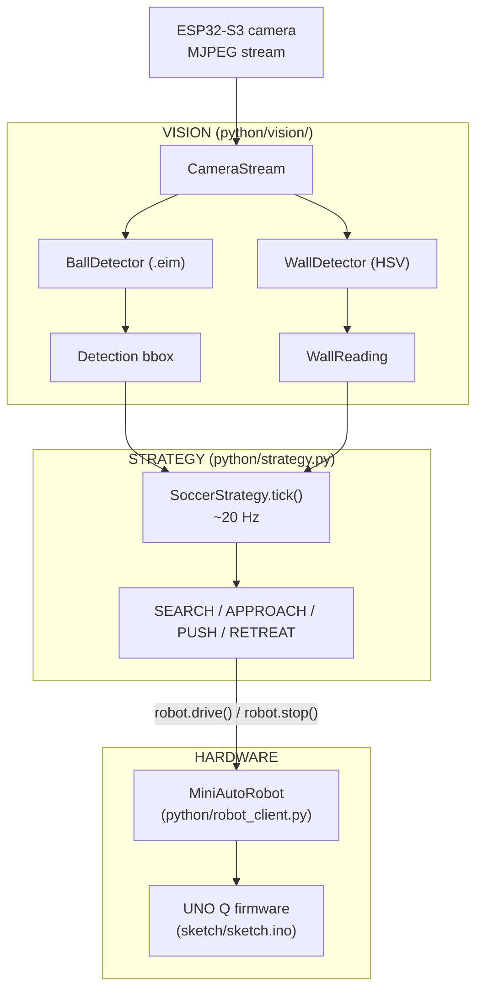

# Robot Soccer — Behavior Architecture

Design document for the autonomous soccer behavior stack.
Read this before picking up a submodule.

---

## Context

**Robot:** Hiwonder miniAuto on Arduino UNO Q — 4 mecanum wheels (holonomic),
ultrasonic distance sensor, 4-channel line sensor, onboard RGB LED and buzzer.

**Vision:** Hiwonder ESP32-S3 camera → MJPEG stream at
`http://192.168.5.1:81/stream` (320×240 QVGA).
An Edge Impulse object-detection model (`.eim`, not committed — see `.gitignore`)
runs on the Python/Linux side and detects three classes: `soccerball`, `robot`,
`goal`.

**Field-side detection:** The field walls are taped RED or BLUE.
`vision/wall_detector.py` classifies which color dominates the current frame
using HSV thresholding — no ML model required.

**Team assignment:** Holding the CAM boot button for 5 seconds toggles team
(RED/BLUE). Read via `robot.hold_toggle()` — `False` = RED, `True` = BLUE.
Strategy uses this to decide which wall color to push toward.

---

## System Diagram



---

## States

**Default / resting state is SEARCH.**
The robot scans by rotating until it sees the ball.

| State | Entry | Behavior | Exits to |
|---|---|---|---|
| `SEARCH` | startup; ball lost for ≥ `LOST_BALL_GRACE_TICKS` | Rotate left at `SEARCH_SPEED` | `APPROACH` when ball detected |
| `APPROACH` | Ball detected | If offset > `CENTER_DEADBAND` → rotate to center; else drive forward | `PUSH` when ball bbox height ≥ `CLOSE_HEIGHT_THRESHOLD`; `SEARCH` if ball lost |
| `PUSH` | Ball close (bbox height) | Check wall color → if opponent wall: push forward; if own wall: retreat | `RETREAT` if own wall; `APPROACH` if ball drifts off-center |
| `RETREAT` | Own-goal risk detected | Drive backward briefly | `SEARCH` |

---

## File Map

```
python/
├── main.py               # App Lab entry point; builds strategy, runs loop
├── robot_client.py       # MiniAutoRobot Bridge wrapper (hardware API)
│
├── strategy.py           # SoccerStrategy state machine (SEARCH/APPROACH/PUSH/RETREAT)
├── ball_follower.py      # Pure APPROACH-state decision logic — unit-testable, no hardware
│
├── detector.py           # Backend selector: brick or eim (DETECTOR_BACKEND env var)
├── eim_runner.py         # Runs .eim over its native Unix socket protocol
│
├── debug_detect.py       # Live detection viewer — no motion, no BOOT gating
├── capture.py            # Capture frames to disk for ML training
│
└── vision/
    ├── camera_stream.py  # CameraStream — timestamped MJPEG capture via OpenCV
    └── wall_detector.py  # WallDetector — HSV red/blue wall classification
```

---

## Module Descriptions

### `vision/camera_stream.py` — `CameraStream`

Opens the ESP32-S3 MJPEG stream via `cv2.VideoCapture`. Warms up on
`warmup_frames` good frames before returning. `read()` returns
`(frame_bgr | None, age_seconds)`. `age_seconds` is a first-class safety
signal — strategy stops the robot if it exceeds `stale_frame_s`.

### `detector.py` — `make_detector()`

Returns whichever inference backend is configured. Both expose the same call:

```python
detector.detect(jpeg_bytes, image_type="jpg")
# → {"detection": [{"class_name": str, "confidence": str, "bounding_box_xyxy": [x1,y1,x2,y2]}]}
```

Bounding boxes are in **source-frame pixels** from both backends.
Select backend via the `DETECTOR_BACKEND` environment variable:

| Value | Backend | Needs |
|---|---|---|
| `brick` (default) | Arduino App Lab `object_detection` brick | Model registered in board registry |
| `eim` | `eim_runner.py` — runs `.eim` via Unix socket | `EIM_MODEL_PATH` pointing to the `.eim` file |

### `eim_runner.py` — `EimRunner`

Launches the `.eim` as a subprocess and speaks its JSON-over-Unix-socket
protocol. No `edge_impulse_linux` Python package required. Scales bbox
coordinates from model-input pixels back to source-frame pixels so both
backends report in the same space.

### `ball_follower.py` — `BallFollower`

Pure decision logic for the APPROACH state. Takes a detection payload, frame
width, and sensor dict — returns `(command, speed, ms)` or `None` (stop).

- Ball off-center → `rotate_left` / `rotate_right`
- Ball centered + not arrived → `forward`
- Ball centered + arrived (ultrasonic ≤ `arrived_distance_mm`) → `None`
- No ball or bad bbox → `None`

Also exports `_best_ball(detection)` and `_centre_offset(item, frame_w)` as
helpers used by `strategy.py` for the PUSH state.

### `vision/wall_detector.py` — `WallDetector`, `WallReading`

HSV-based — no model required. Returns a `WallReading(side, red_pct, blue_pct)`
where `side` is `"RED"`, `"BLUE"`, or `"UNKNOWN"`. Used by `strategy.py` to
determine safe push direction during PUSH state.

### `strategy.py` — `SoccerStrategy`

Injected with `MiniAutoRobot`, `CameraStream`, `detector`, `WallDetector`,
and a `Config`. Call `tick()` at ~20 Hz. Encodes each OpenCV frame to JPEG
before passing to the detector. All robot motion goes through `robot.drive()`.

**State machine:**

| State | Entry | Behavior | Exits to |
|---|---|---|---|
| `SEARCH` | startup; ball lost ≥ `LOST_BALL_GRACE_TICKS` | Rotate left to scan | `APPROACH` when ball detected |
| `APPROACH` | Ball detected | Delegates to `BallFollower.decide()` for turn/forward | `PUSH` when follower returns `None` (arrived) or bbox height ≥ threshold |
| `PUSH` | Ball close | Check wall color → push toward opponent wall; retreat on own wall | `RETREAT` on own wall; `APPROACH` if ball drifts |
| `RETREAT` | Own-goal risk | Drive backward briefly | `SEARCH` |

**Key tunable constants** (top of `strategy.py`):

| Constant | Default | Description |
|---|---|---|
| `CENTER_DEADBAND` | `0.12` | Offset fraction treated as centered on ball |
| `REALIGN_DEADBAND` | `0.18` | Looser centering tolerance during PUSH |
| `CLOSE_HEIGHT_THRESHOLD` | `0.35` | Ball bbox height fraction = close enough to push |
| `PUSH_OBSTACLE_CM` | `8` | Ultrasonic below this while pushing = unexpected obstacle |
| `LOST_BALL_GRACE_TICKS` | `3` | Missed frames before reverting to SEARCH |

`BallFollower` has its own tunable constants (`TURN_DEADZONE`, `ARRIVED_DISTANCE_MM`,
`FORWARD_SPEED`, `TURN_SPEED`, etc.) at the top of `ball_follower.py`.

### `main.py` — Entry point

Supports two modes via `ROBOCUP_MODE`:

| Mode | Behavior |
|---|---|
| `match` (default) | Builds strategy, runs `SoccerStrategy.tick()` loop |
| `demo` | Canned motion/sensor smoke test — verify wiring before trusting vision |

**Environment variables:**

| Variable | Default | Description |
|---|---|---|
| `DETECTOR_BACKEND` | `brick` | `brick` or `eim` |
| `EIM_MODEL_PATH` | `/app/models/soccer-fomo.eim` | Path to `.eim` (eim backend only) |
| `CAMERA_STREAM_URL` | `http://192.168.5.1:81/stream` | Camera MJPEG URL |
| `ROBOCUP_BALL_LABEL` | `soccerball` | Label string as exported from Edge Impulse |
| `ROBOCUP_BALL_CONFIDENCE` | `0.5` | Minimum confidence threshold |
| `ROBOCUP_WALL_MIN_COVERAGE_PCT` | `2.0` | Min % of frame with wall color to classify |
| `ROBOCUP_STALE_FRAME_MS` | `500` | Max frame age in ms before stopping robot |
| `ROBOCUP_MODE` | `match` | `match` or `demo` |

---

## Design Decisions

**Wall detection is HSV, not the EI model.**
The field walls have consistent, high-saturation red/blue tape. HSV
classification is fast, reliable, and adds no inference overhead. The EI model
is reserved for object detection (ball, robot, goal).

**Dual detector backend (`brick` / `eim`).**
The `brick` backend uses Arduino's built-in object detection — proven path but
requires registering the model in a system-level registry that can be lost on
updates. The `eim` backend runs the model directly via its socket protocol —
no board-level setup, model path lives in code. Both return the same payload
shape so the strategy layer is backend-agnostic.

**APPROACH delegates to `BallFollower`.**
`BallFollower` is pure logic: no hardware calls, no imports from this project.
It can be unit-tested offline and reused independently. `strategy.py` only
invokes it and interprets `None` as "transition to PUSH."

**Default state is SEARCH (rotate and scan).**
A stationary robot loses. Scanning maximizes the chance of finding the ball
quickly from any starting orientation.

**Push direction is determined by wall color, not dead reckoning.**
Dead reckoning drifts fast without encoders. Reading the wall color directly
while in possession is more reliable for knowing which goal is ahead. Opponent
color = safe to push. Own color = retreat to avoid own goal.

**Stale frame = stop.**
If the camera stream drops, the robot stops rather than continuing blind.
Do not remove the stale-frame check.

---

## What Is Not Yet Implemented

Open areas for teammates to pick up — all are self-contained changes to
`strategy.py` and do not require touching firmware or `robot_client.py`:

| Feature | Notes |
|---|---|
| **Opponent robot detection** | `_best_ball(detection)` already works for any label — use it with `"robot"` to detect opponents; add a DEFEND state or evasive motion |
| **Goal object detection** | Same approach with `"goal"` label — could refine push direction vs. wall color alone |
| **Strafe to center on ball** | Mecanum supports sideways motion — strafing during approach keeps the ball centered without rotating in place |
| **Battery low warning** | `read_sensors()["battery_mv"]` < threshold → `robot.led(True)` + `robot.buzz()`, reduce speed |

---

## Quickstart

```bash
# Smoke test — verify motors, servo, sensors (no camera/model needed)
ROBOCUP_MODE=demo python3 /app/python/main.py

# Match mode — eim backend
DETECTOR_BACKEND=eim \
EIM_MODEL_PATH=/app/models/soccer-fomo.eim \
ROBOCUP_MODE=match \
python3 /app/python/main.py

# Match mode — brick backend (model registered on board)
ROBOCUP_MODE=match python3 /app/python/main.py

# Debug detections without motion
DETECTOR_BACKEND=eim \
EIM_MODEL_PATH=/app/models/soccer-fomo.eim \
python3 /app/python/debug_detect.py
```

---

## Validation

```bash
py -m py_compile python/*.py python/vision/*.py
python3 .agents/skills/uno-q-miniauto/scripts/check_robot_contract.py --strict
```

First hardware session checklist:
1. Wheels off the ground
2. `ROBOCUP_MODE=demo` — verify all motors, servo, LED, buzzer respond
3. `ROBOCUP_MODE=match` — confirm camera connects and model loads (labels print to console)
4. Lower the robot; place ball in view and verify SEARCH → APPROACH transition
5. Tune `CLOSE_HEIGHT_THRESHOLD`, `CENTER_DEADBAND`, and `BallFollower.arrived_distance_mm`
   for your field and lighting conditions

---

## Safety Rules

- Every entry point that moves hardware must use `try/finally: robot.stop()`.
- Use `App.run(user_loop=lambda: robot.run_program(loop))` — CAM button is the physical kill switch.
- `robot.drive()` checks `program_enabled` and raises `ProgramStopped` on button press.
- Strategy failures (stale frame, no model, exception) must stop the robot, not continue blind.
- Never scatter `Bridge.call(...)` outside `robot_client.py`.
